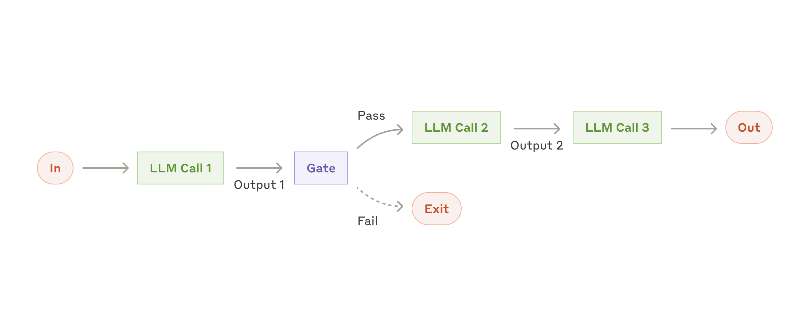
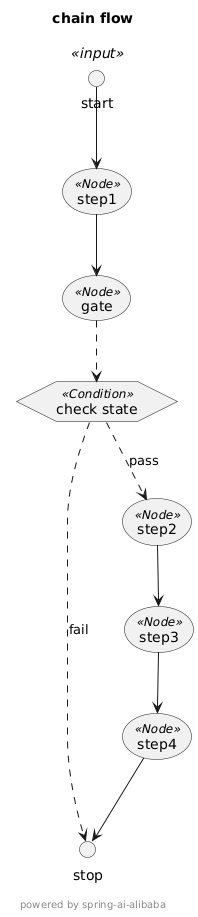
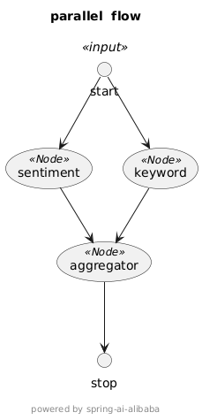
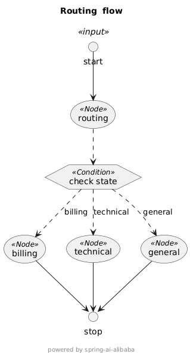
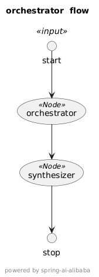
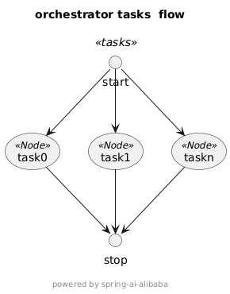
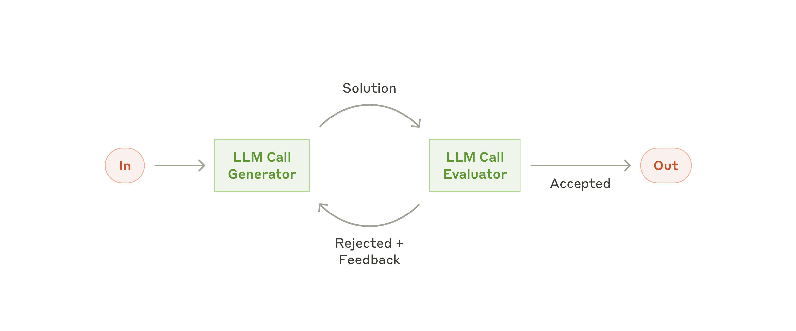
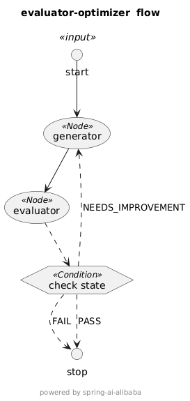

# Spring Ai Alibaba Graph实现五大工作流模式

## 概述

在 <a href="https://www.anthropic.com/engineering/building-effective-agents">building-effective-agents</a>
一文中,Anthropic将"智能体系统"(agentic systems),从架构层面分为 "工作流"（workflows）和 "智能体"（agents）：

工作流(Workflow)：通过预定义代码路径来协调大语言模型（LLMs）和工具的系统。
智能体(Agent)：与之相反，这类系统中的大语言模型可动态指导自身流程及工具使用，自主掌控任务完成。

本文主要讨论的是使用Spring Ai Alibaba Graph实现五种基本工作流。

## 技术实现

采用的技术栈如下：

Spring AI

Spring Boot

Java 17+

Spring AI Alibaba Graph

### spring-ai-alibaba-graph核心概念

1.StateGraph（状态图/工作流图） 定义整个工作流的主类。 支持添加节点（addNode）、边（addEdge、addConditionalEdges）、条件分支、子图等。 可校验图结构，最终编译为 CompiledGraph 以供执行。

2.Node（节点） 表示工作流中的单个步骤（如模型调用、数据处理等）。 支持异步节点，可封装大模型调用或自定义逻辑。

3.Edge（边） 表示节点之间的转移关系。 支持条件分支（根据状态决定下一个节点）。

4.OverAllState（全局状态） 可序列化的全局状态对象，贯穿整个工作流。 支持按 key 注册不同的合并/更新策略（如替换、合并等）。 用于数据传递、断点续跑、人工干预等。

5.CompiledGraph（已编译图） StateGraph 的可执行版本。 负责实际的节点执行、状态流转、结果流式输出。 支持中断、并行节点、检查点等高级特性。

官网<a href="https://github.com/alibaba/spring-ai-alibaba/blob/main/spring-ai-alibaba-graph/README-zh.md">文档</a>

## 工作流模式

### 1. 链式工作流（Chain Workflow）

实现提示词链式处理，将任务分解为一系列 LLM 调用，每个步骤处理前一步的输出。适用于可清晰拆分为固定子任务的场景。如下架构图所示：



#### 使用场景：

具有明确顺序步骤的任务

愿意用延迟换取更高准确性

每个步骤依赖前一步输出

#### 应用案例

数据转换管道

多步骤文本处理

结构化步骤的文档生成

#### 实现

链式工作流（Chain Workflow）如上架构图所示，流程节点包括步骤节点(LLM CALL)和程序检测节点(Gate非必须)。下面示例流程包含4个步骤，
其中step1和step2之间有个检测节点，检测通过继续流程，否则流程结束。

#### 节点定义：

```java

//分步骤处理节点
static class StepNode implements NodeAction {

    private final ChatClient client;
    private final String systemPrompt;
    private final String inputKey;
    private final String outputKey;

    StepNode(ChatClient client, String systemPrompt, String inputKey, String outputKey) {
      this.client = client;
      this.systemPrompt = systemPrompt;
      this.inputKey = inputKey;
      this.outputKey = outputKey;
    }

    @Override
    public Map<String, Object> apply(OverAllState state) {
      String text = (String) state.value(inputKey).orElse("");
      // 调用 LLM
      ChatResponse resp = client.prompt().system(systemPrompt).user(text).call()
          .chatResponse();
      String stepResult = resp.getResult().getOutput().getText();
      return Map.of(outputKey, stepResult);
    }
}

//程序检测节点 programmatic checks非必须
static class GateNode implements NodeAction {

  @Override
  public Map<String, Object> apply(OverAllState state) {
    //一些程序性的检测，如果未通过流程结束
    Map<String, Object> checkResultMap = new HashMap<>();
    checkResultMap.put("checked", "pass");
    // checkResultMap.put("checked",fail);
    return checkResultMap;
  }
}
```

##### 流程编排

```java
public StateGraph chainGraph(ChatModel chatModel) throws GraphStateException {

    ChatClient client = ChatClient.builder(chatModel).defaultAdvisors(new SimpleLoggerAdvisor())
        .build();
    OverAllStateFactory factory = () -> {
      OverAllState s = new OverAllState();
      s.registerKeyAndStrategy("inputText", new ReplaceStrategy());
      s.registerKeyAndStrategy("step1Text", new ReplaceStrategy());
      s.registerKeyAndStrategy("step2Text", new ReplaceStrategy());
      s.registerKeyAndStrategy("step3Text", new ReplaceStrategy());
      s.registerKeyAndStrategy("result", new ReplaceStrategy());
      return s;
    };
    // Step 1
    String step1System = """
        Extract only the numerical values and their associated metrics from the text.
        Format each as'value: metric' on a new line.
        Example format:
        92: customer satisfaction
        45%: revenue growth""";
    // Step 2
    String step2System = """
        Convert all numerical values to percentages where possible.
        If not a percentage or points, convert to decimal (e.g., 92 points -> 92%).
        Keep one number per line.
        Example format:
        92%: customer satisfaction
        45%: revenue growth""";
    // Step 3
    String step3System = """
        Sort all lines in descending order by numerical value.
        Keep the format 'value: metric' on each line.
        Example:
        92%: customer satisfaction
        87%: employee satisfaction""";
    // Step 4
    String step4System = """
        Format the sorted data as a markdown table with columns:
        | Metric | Value |
        |:--|--:|
        | Customer Satisfaction | 92% | """;
    StateGraph graph = new StateGraph("ChainGraph", factory.create());
    graph.addNode("step1", node_async(new StepNode(client, step1System, "inputText", "step1Text")));
    graph.addNode("gate", node_async(new GateNode()));
    graph.addNode("step2", node_async(new StepNode(client, step2System, "step1Text", "step2Text")));
    graph.addNode("step3", node_async(new StepNode(client, step3System, "step2Text", "step3Text")));
    graph.addNode("step4", node_async(new StepNode(client, step4System, "step3Text", "result")));
    graph.addEdge(START, "step1");
    graph.addEdge("step1", "gate")
        .addConditionalEdges("gate", edge_async(t -> {
              String checked = (String) t.value("checked").orElse("fail");
              return checked;
            }),
            Map.of("pass", "step2", "fail", END));
    graph.addEdge("step2", "step3");
    graph.addEdge("step3", "step4");
    graph.addEdge("step4", END);
    // 可视化
    GraphRepresentation representation = graph.getGraph(Type.PLANTUML,
        "chain flow");
    System.out.println("\n=== Chain UML Flow ===");
    System.out.println(representation.content());
    System.out.println("==================================\n");

    return graph;
  }
```

上述例子在step1和step2中间加了一个gate节点，模拟在2个结点之前做一个检测，如果复合条件继续下一个节点，否则流程结束。UML图如下：



完整代码:<a href="https://github.com/renpengben/effective-agent-spring-alibaba-graph/tree/master/src/main/java/com/github/renpengben/graph/agentic/patterns/chain">Chain Workflow</a>

### 并行化工作流（Parallelization Workflow）

支持多个 LLM 操作的并发处理，包含两种关键变体：
分块（Sectioning）： 将任务拆分为可并行运行的独立子任务
投票（Voting）： 多次执行同一任务以获取多样化输出。架构图如下：


#### 使用场景：

处理大量相似但独立的任务

需要多个独立视角的任务

处理任务处理速度，并且任务可并行

#### 应用案例

文档批量处理
多视角内容分析
并行验证检查

#### 实现

并行化工作流（Parallelization Workflow）如上架构图所示，流程节点包括并行节点(LLM CALL)和结果合并节点(Aggregator)。下面示例实现一个文本情感分析和
关键字提取的流程，流程中包含节点SentimentAnalysisNode(情感分析),KeywordExtractionNode(关键字提取),结果合并(Aggregator)。

#### 节点定义：

```java
//情感分析节点
static class SentimentAnalysisNode implements NodeAction {

  private final ChatClient client;

  private final String key;

  public SentimentAnalysisNode(ChatClient client, String key) {
    this.client = client;
    this.key = key;
  }

  @Override
  public Map<String, Object> apply(OverAllState state) throws Exception {
    String text = (String) state.value(key).orElse("");
    // 调用 LLM
    ChatResponse resp = client.prompt().user("情感分析: " + text).call()
        .chatResponse();
    String sentiment = resp.getResult().getOutput().getText();
    return Map.of("sentiment", sentiment);
  }

}

//关键字提取节点
static class KeywordExtractionNode implements NodeAction {

  private final ChatClient client;

  private final String key;

  public KeywordExtractionNode(ChatClient client, String key) {
    this.client = client;
    this.key = key;
  }

  @Override
  public Map<String, Object> apply(OverAllState state) throws Exception {
    String text = (String) state.value(key).orElse("");
    ChatResponse resp = client.prompt().user("提取关键字: " + text).call()
        .chatResponse();
    String kws = resp.getResult().getOutput().getText();
    return Map.of("keywords", List.of(kws.split(",\\s*")));
  }

}
//并行结果合并节点
static class AggregatorNode implements NodeAction {

  @Override
  public Map<String, Object> apply(OverAllState state) {
    String sent = (String) state.value("sentiment").orElse("unknown");
    List<?> kws = (List<?>) state.value("keywords").orElse(List.of());
    return Map.of("analysis", Map.of("sentiment", sent, "keywords", kws));
  }

}

```

##### 流程编排

```java
   public StateGraph parallelGraph(ChatModel chatModel) throws GraphStateException {
    ChatClient client = ChatClient.builder(chatModel).defaultAdvisors(new SimpleLoggerAdvisor())
        .build();
    OverAllStateFactory factory = () -> {
      OverAllState s = new OverAllState();
      s.registerKeyAndStrategy("inputText", new ReplaceStrategy());
      s.registerKeyAndStrategy("sentiment", new ReplaceStrategy());
      s.registerKeyAndStrategy("keywords", new ReplaceStrategy());
      s.registerKeyAndStrategy("aggregator", new ReplaceStrategy());
      return s;
    };
    StateGraph graph = new StateGraph("Parallel Flow", factory.create())
        // 注册节点
        .addNode("sentiment", node_async(new SentimentAnalysisNode(client, "inputText")))
        .addNode("keyword", node_async(new KeywordExtractionNode(client, "inputText")))
        .addNode("aggregator", node_async(new AggregatorNode()))
        // 构建并行边：使用单条边携带多目标
        .addEdge(START, "sentiment")
        .addEdge(START, "keyword")
        // 限制：sentiment/keyword 并行后必须合并到同一节点
        .addEdge("sentiment", "aggregator")
        .addEdge("keyword", "aggregator")

        .addEdge("aggregator", END);

    // 可视化
    GraphRepresentation representation = graph.getGraph(GraphRepresentation.Type.PLANTUML,
        "parallel  flow");
    System.out.println("\n=== Parallel  UML Flow ===");
    System.out.println(representation.content());
    System.out.println("==================================\n");

    return graph;
  }
```

UML图如下：



完整代码:<a href="https://github.com/renpengben/effective-agent-spring-alibaba-graph/tree/master/src/main/java/com/github/renpengben/graph/agentic/patterns/parallel">Parallel Workflow</a>

### 路由工作流（Routing Workflow）

路由对输入进行分类，并将其定向到专门的后续任务。架构图如下：


#### 使用场景：

输入具有明确类别的复杂任务
不同输入需要专门处理
可准确分类的任务

#### 应用案例

客户支持工单路由
内容审核系统
基于复杂度的查询优化

#### 实现

路由工作流（Routing Workflow）如上架构图所示，流程节点包括路由节点(LLM Router)负责任务分类选择后续专门处理节点，和专门LLM处理节点(LLM CALL)。
下面示例实现客服问题处理流程,流程接受到问题经过路由节点(LlmCallRouterNode)处理，大模型给出选择的后续任务处理节点(SelectionLlmNode),专门任务处理节点
有三种：账单问题处理，技术问题处理，一般问题处理(默认)。

#### 节点定义：

```java
  //选择的专门任务处理节点
static class SelectionLlmNode implements NodeAction {

  private final ChatClient client;

  public SelectionLlmNode(ChatClient client) {
    this.client = client;
  }

  @Override
  public Map<String, Object> apply(OverAllState state) {
    String inputText = (String) state.value("inputText").orElse("");
    String selectionLlm = (String) state.value("selectionLlm").orElse("");
    String result = client.prompt().system(availableRoutes.get(selectionLlm).toString())
        .user(inputText).call().chatResponse().getResult().getOutput()
        .getText();
    return Map.of("result", result);
  }
}

//大模型问题分类路由节点
static class LlmCallRouterNode implements NodeAction {

  private final ChatClient client;
  private final String inputTextKey;

  public LlmCallRouterNode(ChatClient client, String inputTextKey) {
    this.client = client;
    this.inputTextKey = inputTextKey;
  }

  @Override
  public Map<String, Object> apply(OverAllState state) {
    String inputText = (String) state.value(inputTextKey).orElse("");
    String selectorPrompt = String.format("""
        Analyze the input and select the most appropriate support team from these options: %s
        First explain your reasoning, then provide your selection in this JSON format:

        \\{
            "reasoning": "Brief explanation of why this ticket should be routed to a specific team.
                        Consider key terms, user intent, and urgency level.",
            "selection": "The chosen team name"
        \\}

        Input: %s""", availableRoutes.keySet(), inputText);

    LlmRoutingResponse llmRoutingResponse = client.prompt(selectorPrompt).call()
        .entity(LlmRoutingResponse.class);
    Map<String, Object> selectionLlmMap = new HashMap<>();
    selectionLlmMap.put("selectionLlm", llmRoutingResponse.selection);
    return selectionLlmMap;
  }
}

public record LlmRoutingResponse(String reasoning, String selection) {

}
```

##### 流程编排

```java
  private static Map<String, Object> availableRoutes = new HashMap<>();

  static {
    availableRoutes.put("billing", "You are a billing specialist. Help resolve billing issues...");
    availableRoutes.put("technical",
        "You are a technical support engineer. Help solve technical problems...");
    availableRoutes.put("general",
        "You are a customer service representative. Help with general inquiries...");
  }
  
  public StateGraph routingGraph(ChatModel chatModel) throws GraphStateException {
    ChatClient client = ChatClient.builder(chatModel).defaultAdvisors(new SimpleLoggerAdvisor())
        .build();
    OverAllStateFactory factory = () -> {
      OverAllState s = new OverAllState();
      s.registerKeyAndStrategy("inputText", new ReplaceStrategy());
      s.registerKeyAndStrategy("selectionLlm", new ReplaceStrategy());
      return s;
    };

    StateGraph graph = new StateGraph("ParallelDemo", factory.create())
        // 注册节点
        .addNode("routing", node_async(new LlmCallRouterNode(client, "inputText")))
        .addNode("billing", node_async(new SelectionLlmNode(client)))
        .addNode("technical", node_async(new SelectionLlmNode(client)))
        .addNode("general", node_async(new SelectionLlmNode(client)))
        // 构建并行边：使用单条边携带多目标
        .addEdge(START, "routing")
        .addConditionalEdges("routing", AsyncEdgeAction.edge_async(new EdgeAction() {
          @Override
          public String apply(OverAllState state) {
            String selection = (String) state.value("selectionLlm").orElse("");
            return selection;
          }
        }), Map.of("billing", "billing", "technical", "technical", "general", "general"))
        .addEdge("billing", END)
        .addEdge("technical", END)
        .addEdge("general", END);

    // 可视化
    GraphRepresentation representation = graph.getGraph(GraphRepresentation.Type.PLANTUML,
        "Routing  flow");
    System.out.println("\n=== Routing  UML Flow ===");
    System.out.println(representation.content());
    System.out.println("==================================\n");

    return graph;
  }
```

UML图如下：



完整代码:<a href="https://github.com/renpengben/effective-agent-spring-alibaba-graph/tree/master/src/main/java/com/github/renpengben/graph/agentic/patterns/routing">Routing Workflow</a>

### Orchestrator-Workers

Orchestrator-Workers 工作流中，一个中心LLM动态分解任务，将它们委托给工作LLM，并综合它们的结果。它与并行化工作流（Parallelization Workflow）最大区别在于，
它分解的任务数量不固定。架构图如下：


#### 使用场景：

子任务无法预先预测的复杂任务
需要不同方法或视角的任务
需要自适应问题解决的场景

#### 应用案例

复杂代码生成任务
多源研究任务
自适应内容创作

#### 实现

Orchestrator-Workers如上架构图所示，流程节点包括编排节点(Orchestrator)负责任务拆解，工作节点(LLM CALL)，结果合并节点(Synthesizer)。
下面示例实现写作工作流，用户输入写作的主题，编排节点拆解成子任务，并启动并行流程执行子任务，最后Synthesizer节点合并结果。

##### 节点定义

```java
  //编排节点
static class OrchestratorNode implements NodeAction {
  private final ChatClient client;
  OrchestratorNode(ChatClient client) {
    this.client=client;
  }
  @Override
  public Map<String, Object> apply(OverAllState state) throws GraphStateException {
    String DEFAULT_ORCHESTRATOR_PROMPT = """
        Analyze this task and break it down into 2-3 distinct approaches:

        Task: {task}

        Return your response in this JSON format:
        \\{
        "analysis": "Explain your understanding of the task and which variations would be valuable.
                     Focus on how each approach serves different aspects of the task.",
        "tasks": [
        	\\{
        	"type": "formal",
        	"description": "Write a precise, technical version that emphasizes specifications"
        	\\},
        	\\{
        	"type": "conversational",
        	"description": "Write an engaging, friendly version that connects with readers"
        	\\}
        ]
        \\}
        """;
    String text = (String) state.value("inputText").orElse("");
    OrchestratorResponse orchestratorResponse = client.prompt()
        .user(u -> u.text(DEFAULT_ORCHESTRATOR_PROMPT)
            .param("task", text))
        .call()
        .entity(OrchestratorResponse.class);
    //任务拆改后,批量并行执行子任务
    OverAllStateFactory factory = () -> {
      OverAllState s = new OverAllState();
      s.registerKeyAndStrategy("inputText", new ReplaceStrategy());
      s.registerKeyAndStrategy("result",new AppendStrategy());
      s.registerKeyAndStrategy("outputText",new ReplaceStrategy());
      return s;
    };
    StateGraph stateGraph = new StateGraph(() -> factory.create());
    for (int i = 0; i < orchestratorResponse.tasks.size(); i++) {
      stateGraph.addNode("task"+i,node_async(new TaskCallLlmNode(client,orchestratorResponse.tasks.get(i))))
          .addEdge(START,"task"+i)
          .addEdge("task"+i,END);

    }
    // 可视化
    GraphRepresentation representation = stateGraph.getGraph(GraphRepresentation.Type.PLANTUML,
        "orchestrator task  flow");
    System.out.println("\n=== Orchestrator Task  UML Flow ===");
    System.out.println(representation.content());
    System.out.println("==================================\n");
    CompileConfig compileConfig = CompileConfig.builder().saverConfig(SaverConfig.builder().build()).build();
    Map<String, Object> taskResults = stateGraph.compile(compileConfig).invoke(Map.of("inputText", text)).get().data();
    ArrayList result =(ArrayList) taskResults.get("result");
    return Map.of("taskResult",result);
  }
}

//工作处理节点
static class WorkerLlmNode implements NodeAction {
  private ChatClient client;
  private Task task;
  String DEFAULT_WORKER_PROMPT = """
      Generate content based on:
      Task: {original_task}
      Style: {task_type}
      Guidelines: {task_description}
      """;

  public WorkerLlmNode(ChatClient client,Task task) {
    this.client = client;
    this.task=task;
  }

  @Override
  public Map<String, Object> apply(OverAllState state) throws Exception {
    String taskDescription = (String) state.value("inputText").orElse("");
    String result = client.prompt()
        .user(u -> u.text(DEFAULT_WORKER_PROMPT)
            .param("original_task", taskDescription)
            .param("task_type", task.type())
            .param("task_description", task.description()))
        .call()
        .content();
    return Map.of("result", result);
  }
}
//结果合并节点
static class SynthesizerNode implements NodeAction {

  @Override
  public Map<String, Object> apply(OverAllState state) throws Exception {
    Object result = state.value("result").orElse("");
    return Map.of("outputText", result);
  }
}

```

#### 流程编排：

```java
  @Bean
  public StateGraph orchestratorGraph(ChatModel chatModel) throws GraphStateException {
    ChatClient client = ChatClient.builder(chatModel).defaultAdvisors(new SimpleLoggerAdvisor())
        .build();
    OverAllStateFactory factory = () -> {
      OverAllState s = new OverAllState();
      s.registerKeyAndStrategy("inputText", new ReplaceStrategy());
      s.registerKeyAndStrategy("taskResult", new ReplaceStrategy());
      return s;
    };
    StateGraph graph = new StateGraph("OrchestratorGraph", factory.create())
        // 注册节点
            .addNode("orchestrator",node_async(new OrchestratorNode(client)))
            .addNode("synthesizer",node_async(new SynthesizerNode()))
        .addEdge(START, "orchestrator")
       .addEdge("orchestrator","synthesizer")
        .addEdge("synthesizer",END);

    // 可视化
    GraphRepresentation representation = graph.getGraph(GraphRepresentation.Type.PLANTUML,
        "orchestrator  flow");
    System.out.println("\n=== Orchestrator  UML Flow ===");
    System.out.println(representation.content());
    System.out.println("==================================\n");

    return graph;
  }
```

UML图如下：



子任务并行流程，任务数量动态



完整代码:<a href="https://github.com/renpengben/effective-agent-spring-alibaba-graph/tree/master/src/main/java/com/github/renpengben/graph/agentic/patterns/orchestrator">Orchestrator Workflow</a>

### 评估-优化工作流（Evaluator-Optimizer）

在评估-优化工作流中，一个LLM调用生成响应，而另一个调用在循环中提供评估和反馈。架构如下


#### 使用场景：

存在明确评估标准时
迭代优化能带来可衡量价值时
任务受益于多轮批判时

#### 应用案例

代码审查与改进
内容质量优化
翻译精修
复杂搜索任务

#### 实现

评估-优化工作流（Evaluator-Optimizer）如上架构图所示，流程节点包括内容生成节点(Orchestrator)，评估反馈节点(EvaluateNode)。
下面示例实现代码生成工作流，用户输入要生成的代码描述，生成内容节点(GeneratorNode)生成代码，然后评估反馈节点(EvaluateNode)生成反馈和是否达标,如果不符合要求
继续生成内容，一直循环知道评估通过。

#### 节点定义：

```java
/**
   * 生成内容节点
   */
  static class GeneratorNode implements NodeAction {

    private final ChatClient chatClient;
    private final String generatorPrompt;

    public GeneratorNode(ChatClient chatClient, String generatorPrompt) {
      this.chatClient = chatClient;
      this.generatorPrompt = generatorPrompt;
    }

    public GeneratorNode(ChatClient chatClient) {
      this.chatClient = chatClient;
      this.generatorPrompt = DEFAULT_GENERATOR_PROMPT;
    }

    @Override
    public Map<String, Object> apply(OverAllState state) throws Exception {
      String task = (String) state.value("task").orElse("");
      String context = (String) state.value("context").orElse("");
      Generation generationResponse = chatClient.prompt()
          .user(u -> u.text("{prompt}\n{context}\nTask: {task}")
              .param("prompt", this.generatorPrompt)
              .param("context", context)
              .param("task", task))
          .call()
          .entity(Generation.class);
      System.out.println(
          String.format("\n=== GENERATOR OUTPUT ===\nTHOUGHTS: %s\n\nRESPONSE:\n %s\n",
              generationResponse.thoughts(), generationResponse.response()));
      return Map.of("context", generationResponse.response, "historyContext",
          generationResponse.response, "chainOfThought",
          generationResponse);
    }
  }

  /**
   * 评估内容节点
   */
  static class EvaluateNode implements NodeAction {


    private final ChatClient chatClient;
    private final String evaluatorPrompt;

    public EvaluateNode(ChatClient chatClient, String evaluatorPrompt) {
      this.chatClient = chatClient;
      this.evaluatorPrompt = evaluatorPrompt;
    }

    public EvaluateNode(ChatClient chatClient) {
      this.chatClient = chatClient;
      this.evaluatorPrompt = DEFAULT_EVALUATOR_PROMPT;
    }

    @Override
    public Map<String, Object> apply(OverAllState state) throws Exception {
      String context = (String) state.value("context").orElse("");
      String task = (String) state.value("task").orElse("");
      EvaluationResponse evaluationResponse = chatClient.prompt()
          .user(u -> u.text("{prompt}\nOriginal task: {task}\nContent to evaluate: {content}")
              .param("prompt", evaluatorPrompt)
              .param("task", task)
              .param("content", context))
          .call()
          .entity(EvaluationResponse.class);
      System.out.println(
          String.format("\n===评估输出 ===\n评估内容: %s\n\n反馈结果: %s\n",
              evaluationResponse.evaluation(), evaluationResponse.feedback()));
      //累计结果
      List<String> historyContext = (List<String>) state.value("historyContext").orElse("");
      StringBuilder newContext = new StringBuilder();
      newContext.append("Previous attempts:");
      for (String hc : historyContext) {
        newContext.append("\n- ").append(hc);
      }
      newContext.append("\nFeedback: ").append(evaluationResponse.feedback());
      return Map.of("evaluationType", evaluationResponse.evaluation, "context",
          newContext.toString());
    }

    /**
     * 根据评估解决，选择下一步EdgeAction
     */
    static class EvaluateEdgeAction implements EdgeAction {


      @Override
      public String apply(OverAllState state) throws Exception {
        Evaluation evaluationType = (Evaluation) state.value("evaluationType").orElse("");
        return evaluationType.name();
      }
    }

    public record EvaluationResponse(Evaluation evaluation, String feedback) {

      public enum Evaluation {
        PASS, NEEDS_IMPROVEMENT, FAIL
      }
    }

    public record Generation(String thoughts, String response) {

    }
  }
```

##### 流程编排

```java
 public StateGraph evaluatorOptimizerGraph(ChatModel chatModel) throws GraphStateException {
    ChatClient client = ChatClient.builder(chatModel).defaultAdvisors(new SimpleLoggerAdvisor())
        .build();
    OverAllStateFactory factory = () -> {
      OverAllState s = new OverAllState();
      //任务
      s.registerKeyAndStrategy("task", new ReplaceStrategy());
      //生成内容和思考内容，值覆盖
      s.registerKeyAndStrategy("context", new ReplaceStrategy());
      //生成的内容的历史记录List<String>
      s.registerKeyAndStrategy("historyContext", new AppendStrategy());
      //List<Generation>历史生成内容对象
      s.registerKeyAndStrategy("chainOfThought", new AppendStrategy());
      //评估结果类型
      s.registerKeyAndStrategy("evaluationType", new ReplaceStrategy());

      return s;
    };
    StateGraph graph = new StateGraph("EvaluatorOptimizerGraph", factory.create())
        // 注册节点
        .addNode("generator", node_async(new GeneratorNode(client)))
        .addNode("evaluator", node_async(new EvaluateNode(client)))
        .addEdge(START, "generator")
        .addEdge("generator", "evaluator")
        .addConditionalEdges("evaluator", AsyncEdgeAction.edge_async(new EvaluateEdgeAction()),
            Map.of("PASS", END, "NEEDS_IMPROVEMENT", "generator", "FAIL", END));

    // 可视化
    GraphRepresentation representation = graph.getGraph(GraphRepresentation.Type.PLANTUML,
        "evaluator-optimizer  flow");
    System.out.println("\n=== EvaluatorOptimizer  UML Flow ===");
    System.out.println(representation.content());
    System.out.println("==================================\n");

    return graph;
  }
```

UML图如下：



完整代码:<a href="https://github.com/renpengben/effective-agent-spring-alibaba-graph/tree/master/src/main/java/com/github/renpengben/graph/agentic/patterns/evaluatoroptimizer">Evaluator Workflow</a>
